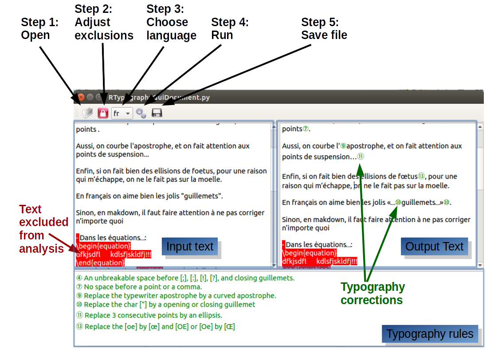

# RTypography

RTypography is a software that correct the typography in text files. It has been
written by Renaud Helbig (Grumpfou). It is published under the license the
license GNU General Public License v3.0. It has been written in Python3.5.2 (and
tested only for this one).

The GUI version is tested with the PyQt 5.9.1.

See: https://github.com/grumpfou/RTypography

## Accepted files:

The software has been written to handle markdown files (\*.md, \*.mkd), it
should also work on simple text files (\*.txt).

## Command line version

One can use the command line version of the software. No additional library is
needed in that case.

### Example

Prints the about section:
> python3 RTypography.py --about

Prints the text with in red the section that will not be  considered during the
correction (do not save any  output file)
> python3 RTypography.py --print_excludes foo.txt

Export the text in English, French, etc.
> python3 RTypography.py --language en foo.txt

> python3 RTypography.py --language fr foo.txt

Prints the changes on the file foo.txt (do not save any
output file)
> python3 RTypography.py --language en --print_changes foo.txt

To specify the file to which file you want to export:
> python3 RTypography.py --language en --export foo_typo.txt foo.txt

## GUI version

One can use graphical version of the software. In that case, one need to install
PyQt 5 (preferably PyQt 5.9.1).

One can launch the GUI interface by:
> python3 RTypography.py --gui

You can still specify the language and the file to open if you want:
> python3 RTypography.py --gui --language fr foo_txt.fr

- Step 1: Open the file you want to convert.
- Step 2: An automatic exclusion of the markdown syntax is made. If you want to
adjust these exclusion, ou can select the text to exclude/incorporate in the
typography analysis and click on the red lock.
- Step 3: choose your language
- Step 4: perform the typography analysis. The output text can be edited if
needed (or you can perform the typography analysis with different exclusions).
- Step 5: save you file. It will be saved under the name 
`pathtoyourfile_typo.md`
